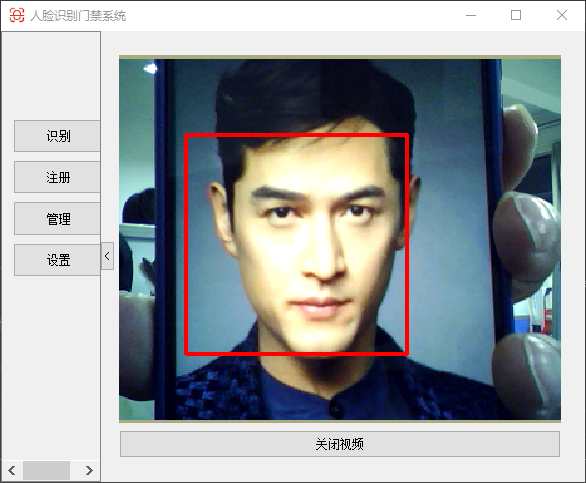

# Qt-AccessControl
Qt 人脸识别门禁管理系统

## 目录

1. [仓库介绍 Introduction](https://github.com/yunke120/Qt-AccessControl#introduction)
2. [所需环境 Environment](https://github.com/yunke120/Qt-AccessControl#environment)
3. [文件下载 Download](https://github.com/yunke120/Qt-AccessControl#download)
4. [使用方式 How2use](https://github.com/yunke120/Qt-AccessControl#how2use)
5. [演示视频 DemoVideo](https://github.com/yunke120/Qt-AccessControl#demovideo)
6. [参考资料 Reference](https://github.com/yunke120/Qt-AccessControl#reference)

## Introduction

​		通过虹软SDK制作的人脸识别门禁系统，支持人脸的检测、识别、注册、删除、查找等，通过`sqlite`数据库进行存储。

​		增加通信接口，当人脸识别成功时，通过串口发送识别成功指令。

## Environment

- QT >= Qt 5
- VS2017 x64
- opencv 2.4.9

## Download

```shell
$git clone https://github.com/yunke120/Qt-AccessControl.git
```


## DemoVideo



## 许可证

[LICENSE](https://github.com/yunke120/Qt-AccessControl/blob/main/LICENSE)

## Reference

- [虹软开发者中心](https://ai.arcsoft.com.cn/ucenter/resource/build/index.html)

- [MySQL入门教程](https://www.cnblogs.com/mr-wid/archive/2013/05/09/3068229.html)

- [QSidePanel](https://github.com/inobelar/QSidePanel)

  

