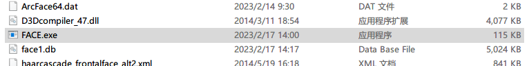
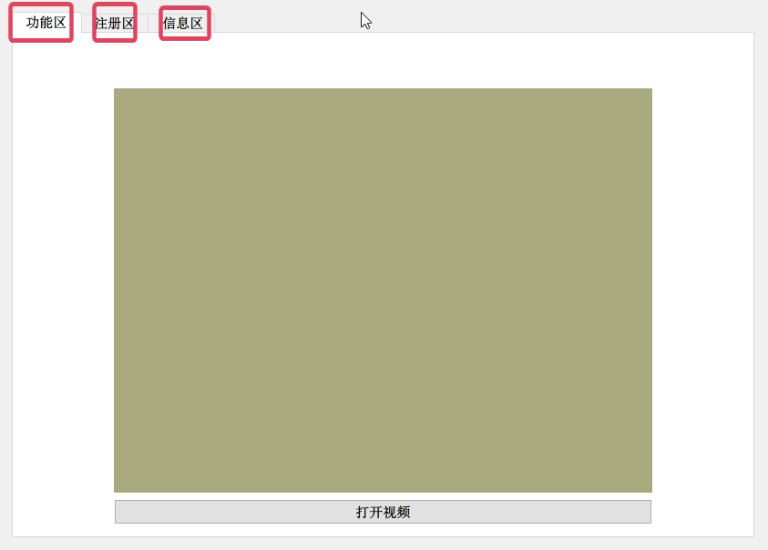
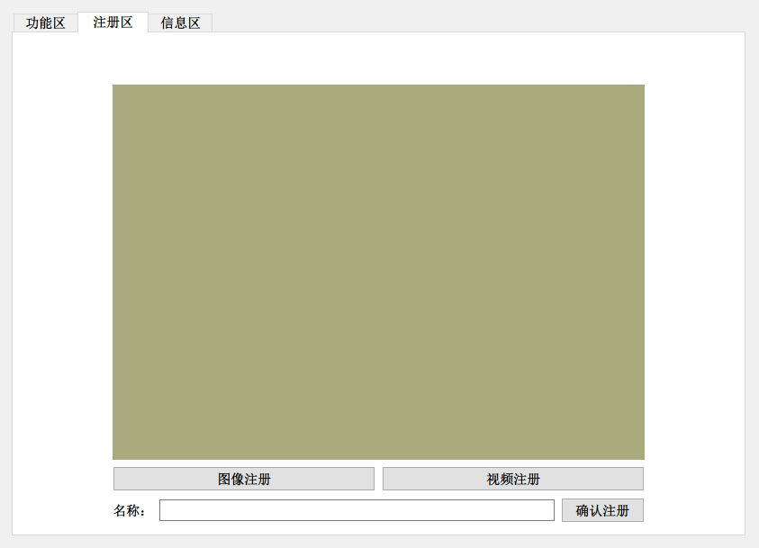
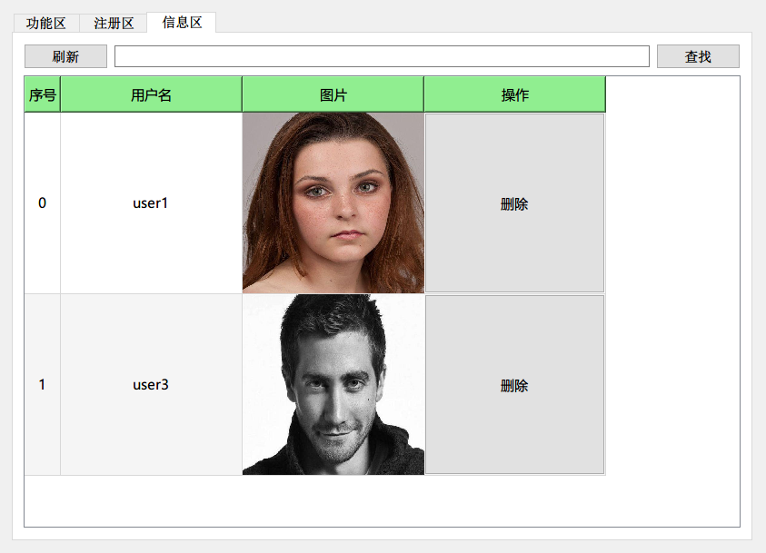
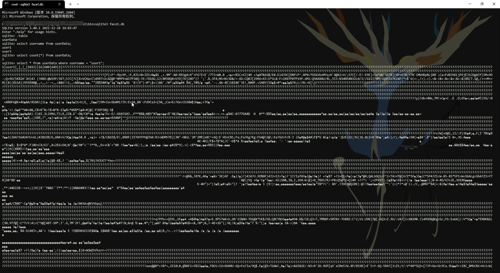

## 功能介绍

人脸识别门禁系统，支持

1. 人脸检测
2. 人脸识别
3. 人脸注册
4. 人脸删除
5. 人脸查找

## 使用方式

打开软件 `FACE.exe`

界面如下

- 功能区为人脸识别界面

- 注册区为注册人脸界面

  

- 信息区为人脸管理界面

​	

### 注册区说明：

支持两种注册方式 **本地图片注册** 与 **视频注册**

每个人脸对应一个名称，所以确定注册前请先选择**注册方式**并**填写人名**(英文)

### 信息区说明

注册完成后可通过**刷新按钮**，人员信息会显示在界面上，可通过在**输入框**中输入人名后点击**查找**，查找此人员信息，可通过操作下面的**删除按键**删除相应人员信息。

### 功能区说明

点击**打开视频**，默认打开**电脑自带**或**USB摄像头**，识别到人脸后如果匹配正确，人脸框为**绿色**，为匹配到为**红色**。

## 其他

人员信息保存在数据库`face1.db`中，可通过`sqlite3.exe`查看

