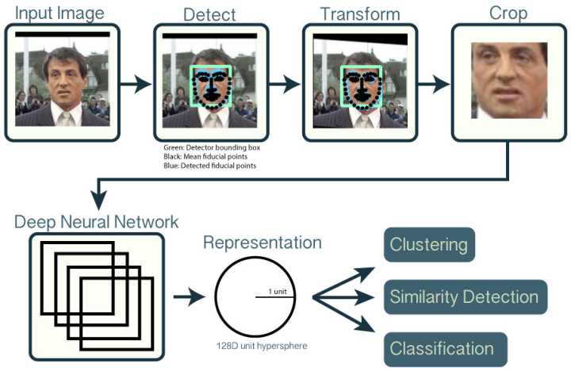
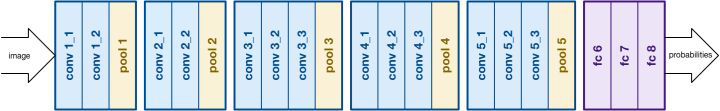

## 摘要

​		近几年，人脸识别已经广泛应用于人们的日常生活中。从智能手机的“刷脸”、社区门禁系统的设计到医疗、公安、金融乃至于国防项目中，计算机视觉技术的应用随处可见。生活水平的提高对安全保障提出了更高的要求，传统门禁系统大多都采用钥匙、门禁卡或者密码等解锁措施，但这存在着很多弊端。密码的泄露、钥匙和门禁卡的丢失都会产生安全和财产隐患，本文将要谈论的是基于人脸识别的门禁控制系统。由于人的脸部生物特征具有唯一性并且人脸识别有着使用方便、识别速度快、识别准确率高等优点，故而高性能的人脸识别门禁系统对于个人、社区和组织机构都具有非凡的意义。

​		本文设计的人脸识别门禁管理系统以Windows电脑为平台，通过Qt设计上位机软件，采用USB摄像头进行图像的采集和识别。通过摄像头对人脸的检测并与采集的人脸数据库进行对比，可以实现人脸的识别。根据识别的置信度，当人脸识别结果高于置信度时，人脸框变成绿色；当人脸识别结果低于置信度时，人脸框变成红色。

**关键词**：人脸识别；OpenCV；置信度

# **Abstract**

​		In recent years, face recognition has been widely used in People's Daily life. The application of computer vision technology can be seen everywhere from the "face brushing" of smart phones and the design of entrance control systems in communities to medical, public security, finance and even national defense projects. The improvement of living standards has put forward higher requirements for security. Most of the traditional access control systems adopt unlock measures such as key, access control card or password, but there are many drawbacks. The leakage of the password, the loss of the key and the access control card will produce security and property risks. This article will talk about the access control system based on face recognition. Due to the uniqueness of human facial biometric features and face recognition has the advantages of convenient use, fast recognition speed and high recognition accuracy, the high-performance face recognition access control system has extraordinary significance for individuals, communities and organizations.

​		The face recognition access control system designed in this paper takes Windows computer as the platform, uses Qt to design the upper computer software, and uses USB camera for image acquisition and recognition. Face recognition can be realized by detecting the face of the camera and comparing it with the collected face database. According to the confidence of recognition, when the face recognition result is higher than the confidence, the face frame turns green; When the result of face recognition is lower than confidence, the face frame turns red.

**Keywords**: Face Recognition;OpenCV;Degree of Confidence

## 第一章 绪论

​		随着经济的发展和科学技术的进步，建筑智能化己经成为一种发展趋势，而门禁系统作为智能建筑中必不可少的一部分，所以受到人们越来越多的关注。门禁是保障人们人身财产安全、维护社会繁荣稳定的重要组成部分，门禁的开启实质上是对人进行身份的认定，判断其身份的合法性。而生物特征识别被认为是当前身份认证中最先进的技术之一，可以将生物特征识别技术结合人工智能、机器视觉、图像处理等其他的相关技术一起运用到门禁系统里，提高门禁系统的准确性、安全性、便捷性等各个方面的性能。

### 1.1 项目背景和意义

​		经过数十年的发展，生物特征技术不断的发展，现阶段，利用生物所具有的特征进行感知辨别的技术己经有指纹、掌纹、声音、视网膜等技术了，在这些当中，指纹感知辨别存在使用后会留下印记，容易被其他人获取印记还原出指纹形状的情况，掌纹识别准确度不高，技术工程量巨大，不宜持久推广。虹膜识别设备太昂贵，无法广泛推广。视网膜技术可能会对使用者造成健康损害。声音识别易受身体状况、年龄、情绪、环境等的影响。人脸识别技术是一种生物特征识别技术，具有精度高、使用方便、定性稳定、不易伪造、性价比高等特点。它的主要工作原理是基于人脸部的特征信息具有惟一性、普遍性以及稳定性等特性，利用图像采集设备捕获人脸的数字图像信息，然后根据相关的人脸识别算法对人脸对象进行数据分析，并与己存储在数据库中的图像进行数据的对比和匹配，最终给出识别结果。因此在高档小区、单位考勤、演唱会观众验证等方面具有广阔的市场应用前景。

​		虽然人脸识别技术相对于虹膜、指纹、语音等技术有很多独特的优势，但也有很多劣势，比如人脸识别的光照条件（如昼夜、室内外等）、脸部的许多遮掩物（比如刘海、防尘面罩），岁数，面部的朝向等要素的影响。此外，一直以来的通过人脸感知辨别的门禁系统很难分辨人脸的真假，容易被偷拍的图像或者网上下载的视频以及用仿真材料制作的三围人脸模型所欺骗，因此会带来一些安全隐患。为了使门禁系统拥有更高的安全性和准确性，更好的服务于人们的生活，所以对人脸识别进行进一步研究是很有必要的。
​		目前解决光照条件变换的方法可以分为两种：第一种，了解光照情况改变的原因并极大限度的减少这种影响，第二种，利用主动热成像技术，让图像处在比较固定的光照下所采集到的图像的特点，或具有不受光照条件变化影响的采集方式获得的图像的特点。本文采用的是第二种方法，利用主动近红外摄像技术，来获取人脸图像，从而可以大幅度减少光照条件变化对人脸识别性能的影响。另外为了解决人脸识别中的欺骗问题，本文采用近红外人脸活体检测，它可以根据热辐射现象通过红外成像来判断是否是活体人脸，防止非法欺骗。本文的研究是基于近红外图像的人脸识别门禁系统，不仅改善了由于光照条件变化引起的识别率不高的问题，而且采用活体检测极大的提高了门禁系统的安全性，所以，具有很强的实际意义。

### 1.2 国内外研究现状

​		人脸面部感知辨别的发展阶段可划分为早期阶段、中期阶段、当前阶段三个不同阶段1964年到1990年，是人脸识别技术的早期发展阶段，人脸识别往往只是作为一种常见的它所运用的方案是以几何特征为基础，主要研究人脸的解剖面，从脸的轮廓，还有曲线特征展开研究分析。人工神经网络在很长的时间内也由研究者运用到人脸感知辨别问题中。除了Bledsoe141之外，早期进行人脸识别工作的研究人员包括GoIdstein，Harmon和KanadeTakeo.JinYuwuXiong于1973年在京都大学完成了他的第一篇关于AFR的博士论文。迄今为止，作为卡内基梅隆大学机器人研宄所（CMU)的教授，他依旧是面部识别领域的活跃人物。他的研宄团队也是面部识别领域的重要力量。总的来说，这一个时期是最开始研宄的时期，因此没有许多重要的结论，在实际的使用当中也没有许多价值。

​		1991年到1997年，人脸识别技术的中期发展阶段。该阶段仅仅只有6年的时间，但一定不要小看这短短的6年，它却是人脸识别技术的腾飞期。在本时期中，诞生了好几个具有典型代表性的人脸识别算法，最为知名的就是美国军方组织的FERE曱6]人脸识别算法测试。在这个阶段中，逐渐出现了一种商用人脸识别系统，在当时比较出名的是Visionics（现为ldentix Facelt系统）。

​		麻省理工学院的Turk与pentland图在深入研究的基础上，针对性的提出了“特征脸”的方法，在当时是一种非常著名的人员识别方法。在此之后，许多人脸识别技术或多或少都与特征人脸相关。就目前来看，在人脸识别性能的测试中，归一化方法与特征脸方法是非常精准的方法。在本发展阶段中还有一项非常重要的工作，1992年来自于麻省理工学院的Brunelli与，他们进行了一系列的比较实验。他们对两种方法进行了比较，一是基于结构特征的识别方法，二是基于模板匹配的识别方法；在深入对比研究的基础上，他们得出了更加明确的结论，和基于特征的方法相比，基于模板匹配的方法更科学、更合理。特征脸方法的问世及其这一结论的得出，这让很多研宄专家停止了基于结构特征的研宄，但在一定程度上却促进了某些研究技术的发展，一是基于统计模式的人脸识别技术的发展，二是基于表观的线性子空间建模技术的发展；这两种技术在当时慢慢成为人脸识别技术的主要发展趋势。
Belhumeur等人在深入研究的基础上，提出了基于Fisherface的人脸识别方法。就当时来看这种识别方法是另一项非常重要的成就，这种方法首先利用在了特征脸之中，其主要作用是降维。在这样的基础之上，有效结合线性判别分析对维数进行了主成分的变化。

​		在本阶段的发展中，还有一种特别重要的识别方法，那就是弹性图匹配技术(EGN，ElasticGraphMatching)。在这种算法中，其核心思路是，利用属性图来对人脸进行描述，在特征图中顶点代表的是人脸的一些关键特征点，它的属性就是Gabor变换特征卩2·17]，人们也把它叫做Jet；边的属性呈现出来的是不同特征点之间的几何关系。对于随意输入的任何一个人脸图像，通过弹性图匹配技术可以进行优化搜索，从多个预定义的人脸关键特征点进行搜索匹配，同时将他们的特征提取出来，进而将输入图像的属性图展示出来。最后再对人脸属性图的相似性进行专业性的计算，从而完成整个识别过程。这种方法有两个优点，一是可以对人脸的关键局部特征进行针对性的建模，二是可以有效保留人脸的全局结构特征。最近还出现了这种方法的前沿性拓展。

​		局部特征分析基础来源于Atick等人（洛克菲勒大学）卩8]，从本质上来说，LFA是一种以统计为核心的低维度对象描述性方法。和PCA相比，LFA的优势更加明显，它不但拥有更强的描述能力，而且具备更优的辨别能力。就当前的发展来看，这种技术己经有效商业化到了Face1t系统中，故而并没有出现新的学术进展。

​		在本阶段的发展中，有一个关键事件，那就是FERET项目，该项目直接由美国国防部保驾护航。本项目的目标是开发一个科学、专业、全面的情报执法AFR技术。这个项目总的涵盖了三个部分，第一部分是人脸识别技术的全面研究，第二部分是将FERET人脸图像数据库建立起来，第三部分是有效组织FERET人脸识别性能的过程性评价。在开展该项目的过程中，一共组织了三次面部识别评估，分别是1994年、1995年和1996年。在这些面部识别评估的过程中，对几种非常著名的人脸识别算法进行了全方位的测试，从而有效促进了这种算法的发展。在测试的过程中产生了一个特别重要的贡献，那就是指明了人脸识别技术的发展方向：非理想的状态下，其人脸识别问题的关键性问题，特别是光照与姿态慢慢成为本行业研究的焦点。

​		柔性模型（FlexibleModels）主要分为两种模型，一是主动表观模型（即AAM模型）卩9·22]二是主动形状模型（即ASM模型）。对于该阶段来说，本模型的提出无疑是人脸建模的一个巨大贡献。柔性模型将面部描述为两个相对比较独立的部分，一是2D形状，二是纹理。在建模(PCA)的过程中对统计方法进行了的综合性的使用，巧妙的将二者结合起来，便可以实现统计建模。柔性建模具有巨大的优势，其面部合成能力相当之强。在对面部图像进行提取与模拟的时候，可以有效利用图像分析技术进行。就目前的发展来看，柔性模型己经在面部特征的识别中得到了最为广泛的应用，同时还出现了一些优化过的模型。

​		总之，这一阶段虽然时间特别短，但人脸识别技术的发展相当迅速。因此出现了很多非常知名的人脸识别商业公司。如果从技术解决方案的角度来看，当时的主流技术主要有三种，一是统计模式识别方法，二是线性子空间判别分析方法，三是统计表观模型方法。

​		1998年到现在，人脸识别技术又取得了新的进展。通过人脸识别算法的性能测试发现，在很多的人脸识别技术中特别容易受到相关环境的影响，尤其是姿态、光照、用户的动作等，由于相关环境因素的影响，鲁棒性特别不强。因此姿态问题与光照问题成为人脸识别技术的研究焦点。同时，商业化的人脸识别系统并没有停滞不前，它们也取得了新的发展。与此同时，美国军方在2000年和2002年组织了两次基于FERET测试的商业系统评估。

​		2001年，Shashua提出了一种基于商图像的绘制技术与人脸图像识别技术。它是一种以渲染技术为核心的学习图像集。这种技术能够有效依据光照图像，合成不同光照条件下任意输入人脸图像的图像。在此基础上，Shashua等提出了人脸签名（Signature）图像的相关定义。通过实验的方式证明了该方法的有效性。
​		2014年3月香港中文大学的汤晓鸥教授及其团队，研发出了"DEEPID”软件，它拥有目前业界最高的准确率，在测试中竟然达到了惊人的9&52％的准确率，首次超越了人眼的识别能力（97巧3％），远超其他同类算法的精确率[32]。

### 1.3 报告主要内容

​		报告总共分为以下七章内容：

​		第一章：主要描述项目背景、国内外研发现状、项目开发意义以及项目报告的主要内容。

​		第二章：主要描述系统的关键技术，包括人脸识别技术、UI界面设计技术和数据库技术。

## 第二章 关键技术介绍


### 2.1 人脸识别技术介绍

​		在本项目中主要使用了虹软人脸识别算法，主要使用的人脸技术包括以下几个方面：

1. 人脸检测：人脸检测是指在图像或视频中自动定位出人脸区域的技术。虹软人脸SDK使用基于卷积神经网络的人脸检测算法，可以在不同场景下准确地检测出人脸。
2. 人脸对齐：人脸对齐是指将检测到的人脸图像调整为标准化的形式，使其方便进行后续的特征提取和比对。虹软人脸SDK采用了基于三维模型的人脸对齐算法，可以使得不同人的人脸在角度、尺度和姿态等方面都得到了标准化。
3. 人脸特征提取：人脸特征提取是指将经过对齐的人脸图像转换为高维特征向量的过程。虹软人脸SDK使用深度学习技术，通过多层卷积神经网络，提取出每张人脸的特征向量。
4. 人脸比对：人脸比对是指对两张人脸的特征向量进行相似度比较的过程。虹软人脸SDK采用了基于欧氏距离和余弦相似度的人脸比对算法，可以在较短时间内实现高精度的人脸比对。

​		相比其他人脸识别算法，虹软人脸识别算法有以下优点：

1. 准确性高：虹软人脸识别算法使用深度学习技术和大规模人脸数据集训练模型，具有高度的准确性，可以在不同场景下快速、准确地完成人脸识别任务。
2. 鲁棒性强：虹软人脸识别算法采用了多种技术手段，例如三维人脸建模、多尺度人脸检测、深度学习特征提取等，提升了算法的鲁棒性，能够应对光照、角度、遮挡等多种复杂情况。
3. 速度快：虹软人脸识别算法在保持准确性的前提下，对算法的效率进行了优化，采用了多线程、SIMD指令、GPU加速等技术，可以实现高速的人脸识别。
4. 良好的适应性：虹软人脸识别算法可以支持多种硬件平台和操作系统，同时可以根据实际应用场景进行灵活配置和调整，具有良好的适应性和可定制性。
5. 安全可靠：虹软人脸识别算法支持多种安全防护技术，例如活体检测、防照片攻击等，保证了人脸识别的安全可靠性，可以广泛应用于人脸门禁、支付、认证等场景。

### 2.2 UI界面设计

​		在本项目中软件主要通过Qt进行开发。QT是一款跨平台的C++应用程序开发框架，可以用于开发图形用户界面(GUI)程序、嵌入式设备、跨平台网络应用程序和游戏等。它由Qt Company（前身为Nokia）开发和维护，采用C++语言编写，提供了丰富的类库和工具链，支持多种操作系统，包括Windows、macOS、Linux、Android、iOS等。QT具有以下优点：

1. 跨平台：QT可以在多种操作系统和硬件平台上运行，开发人员可以使用同一套代码开发程序，大大提高了开发效率和代码复用性。
2. 组件库丰富：QT提供了丰富的组件库和控件，包括界面控件、图形渲染、网络通信、数据库、XML解析等，可以帮助开发人员快速构建复杂的应用程序。
3. 易于学习：QT提供了完整的文档和示例代码，而且采用了面向对象的编程思想，使得开发人员可以更快地掌握框架的使用方法和技巧。
4. 支持多种开发模式：QT可以支持多种开发模式，包括命令行、GUI、嵌入式等，开发人员可以根据自己的需求选择适合的模式。
5. 开放源代码：QT是一款开放源代码的框架，遵循了LGPL协议，可以免费使用和修改，也可以通过商业许可证进行商业开发和销售。

### 2.3 数据库技术

​		在本项目中通过sqlite数据库来存储人脸信息，包括人员的名字、人脸特征和人脸图片等。

​		SQLite是一种轻量级的关系型数据库管理系统(RDBMS)，支持SQL语言标准，被广泛应用于各种移动端应用、桌面应用和嵌入式设备中。与其他数据库管理系统不同，SQLite将数据库存储在一个单一的文件中，这使得SQLite的安装和配置非常简单，也不需要任何特殊的服务器进程或后台进程。SQLite具有以下特点：

1. 轻量级：SQLite非常小巧，可以轻松地集成到各种应用程序中，不需要占用太多的系统资源。
2. 独立性：SQLite不需要任何特殊的服务器进程或后台进程，它的所有操作都在应用程序进程中完成。
3. 跨平台：SQLite可以在多种操作系统和编程语言中使用，包括Windows、Linux、macOS、iOS、Android等。
4. 完全免费：SQLite是一款完全免费的软件，没有任何的使用限制，也没有商业授权费用。
5. 高可靠性：SQLite采用了一种高度可靠的崩溃恢复机制，保证了数据的完整性和稳定性。

## 第三章 人脸识别技术

### 3.1 人脸识别的主要方法

​		就目前来看，比较常见的人脸识别方法一般可以分为三种，一是基于模板的人脸识别方法，二是基于模型的人脸识别方法，三是基于几何特征的人脸识别方法。下面我将分别介绍几种常见的算法，并比较它们的优缺点。

**3.1.1 基于几何特征的方法**
		基于几何特征的人脸识别方法，在人脸识别方法的发展中，它是最古老的方法。它的原理是这样的，因为个体的差异性所以造成了每个人的面部都千差万别，因此可以将面部的器官的大小、形状等重要特征做几何描述来进行人脸识别的判断。首先，将人脸的特征用一组特征向量表示，然后由侧轮廓曲线确定若干个显著特征点，比如睛、嘴巴、鼻子、下巴等重要的特征点，最后这些特征向量的匹配结果就是最后识别的结果。这个方法计算简单，然而，由于该方法只考虑面部器官的形状和位置，不注重特征的具体细节，所以很难从人脸图像中提取稳定的特征。这意味着当一个人的面部表情发生很大变化时，或者存在遮挡眼镜等影响的鲁棒性较差时，提取面部特征将变得非常困难，甚至可能是错误的。

​		另外一种可变形模板法，从本质上来说，它也是一种几何特征法。这种方法的原理是：第1步，创建可变形模板；第2步，定义能量函数；第3步，采用模型参数的调整方式将能量函数最小化。在整个过程中，调整之后的模型参数，就是这个器官的几何特征。这种方法的思想有一定的优势，但却存在两个关键性问题，第1个问题是，存在于能量函数中的加权系数，往往只能通过经验来确定，所以推广起来必然会特别困难；第2个问题是，在优化能量函数的过程中会耗费大量的时间，故而很难在实际的生活中进行应用。另外，在使用几何特征来描述的过程中，往往容易忽略一些局部细微特征，这必然导致某些信息的丢失，因此它特别适合于某些粗略分类。除此之外，从准确率的角度来看，一般很难满足特殊性要求，同时计算量也相当大。
**3.1.2 基于特征脸的方法(PCA)**
​		九十年代初期，Turk和Pentland提出了特征脸方法，就目前来看，这种方法是最为流行的一种。这种方法被人们称为PCA脸识别方法，不但简单而且有效。在特征子人脸技术中，其基本思想是，利用统计学的相关理论对人脸图像分布的基本要素进行寻找，它是一种特征向量，可以对人脸图像进行比较接近的显示。故将其称之为特征脸。

​		从本质上来说，特征人脸能够有效反映人脸的结构关系。能够采用特征向量的方式将特征眼、特征颌、特征唇表示出来。故将其统一称为featuresubface。特征子面所生成的子空间，我们把它叫做子脸空间。若图像完全满足阈值，则对条件进行判断，条件满足，则将其判定为人脸。基于特征的人脸识别技术，其主要是利用人脸基准点与常规参数进行比对，并构建识别特征向量。这种方法能够有效地将拓扑关系保留下来，并有效保证了人脸本身所具备的信息。就目前来看，PCA人脸识别方法与模板匹配算法己经成为人脸识别技术中最为精准的算法。1991年，特征人脸技术问世，广大的研究专家对相关理论进行了分析，对有关实验进行了专研，FERET'96测试发现，优化之后的特征人脸算法是当前最为流行的人脸识别技术，它是当前最佳的识别方法。

​		在这种方法中，首先对人脸上的相关部位进行了确定，比如虹膜、鼻子、嘴角等，接着再对几何特征量进行比较精确的计算，这些特征量可以对图形的特征向量进行有效的描述。这种算法的核心主要来源于两个部分，一是图形/神经识别算法，二是局部人脸特征分析；这种算法有效使用了特征部位与面部器官。Turk与Pentland提出了一种基于图像构造主子空间的特征人脸方法，主体呈现出了人脸的形状，所以我们又把它叫做特征人脸，识别的时候，测试的图像通常都会被投影到主元子空间中，接着便会得到一组投影系数，再利用这种投影系数和己知的人脸图像进行全方位的比较。Pentland等人对其效果进行了报道，由报道可知效果相当好，正确率高达95％，但在使用这种方法之前，往往要进行很多的归一化处理工作。

​		以传统特征脸为基础，很多学者认为，特征向量的特征值高，并非就说明它的分类性能好。基于此，多种特征选择方法得到了更快更好的发展。综上所述，特征脸方法，它是一种以变换系数特征为核心的算法，其优势明显，不但简单，而且快速，同时实用；但因为训练集与测试集之间存在灰度相关性，故而也存在一些限制。

**3.1.3 基于神经网络的方法**

​		人工神经网络是一种非线性动态系统，它不但具有较强的自适应能力，而且具有较强的自组织能力。就目前的发展来看，在人脸识别技术中，人工神经网络的研究依然是焦点。针对人工神经网络的研究，valentin提出了一种方法，他以面部为对象，针对性的提取了50个主元，再利用自相关神经网络把它按照一定的原则映射到5维空间中，然后再使用多层感知器进行科学判别；他研究发现，如果测试图像比较简单，那么特殊的效果就会比较好。lntrator等人则对混合神经网络进行了研究，并将其应用在人脸识别技术中，他利用无监督神经网络，进行了精准化的特征提取，利用监督神经网络进行了全面的分类。胡锦涛等人利用六条规则对人脸特征进行了针对性的描述，接着再利用这六条规则对人脸特征进行准确定位。有效利用人脸特征的几何距离，将其精准的输入模糊神经网络，从而实现精准化识别，和基于欧氏距离的方法相比，其效果大为改善。Laurence等人在人脸识别技术中，有效使用了卷积神经网络。他对相邻像素之间的相关知识进行了融合，因而获得了比较理想的效果。Lin等人则使用了以概率决策为基本核心的神经网络，在其主要思想中，针对性的做了强化与反强化的学习，所得到的概率估计结果更好。这些方法都得到了较好的应用，尤其是在人脸识别的各个步骤中。
​		和上文所述的几种方法相比，人工神经网络方法具有更强的优势。主要原因在于，在人脸识别技术中，要利用规则来进行显性的描述，通常都比较困难。而人工神经网络则不一样，它可以通过一定的方式进行规律的隐式表达。它的适应性比较强，也特别容易实现。所以人工神经网络的识别速度比其他方法更快，但他也有缺点所在，即识别率不高。在神经网络方法中，需要将人脸当作一维向量输入，故而传输的节点都比较大，而在人脸识别中降维则是重要目标之一。PCA算法描述：由Anderson和Kohonen提出采用主成分分析(Principlecomponent
Analysis，简称PCA）进行识别。PCA可以有效的将高维向量转化为低维向量，在转化的过程中，可以让低维向量的各个分量的方差达到最大，同时各个分量之间并不相关，故而能够达到最优的特征抽取。目前，基于神经网络的方法具有较高的识别率，但存在一些问题，比如网络训练时间较长，难以收敛等问题。

### 3.2 基于深度学习的人脸识别算法

通过深度学习进行人脸识别的流程如下：



由上图可知人脸识别项目可以分为5个主要步骤：

1. 首先输入一张照片；
2. 对照片检测出人脸并分类出是否为活体；
3. 对检测到的活体人脸进行对齐和裁切人脸；
4. 对对齐和裁切后人脸进行特征提取，表征为特征码；
5. 对表征后成对特征码进行比对。

第一步输入一张原始的可能含有人脸的图像，输出活体人脸位置的bounding box，这一步称之为“人脸检测”（Face Detection），在ArcSoftFace中，使用的是基于卷积神经网络的人脸检测方法。

第二步输入原始图像和人脸位置的bounding box，输出是“校准”过的只含有人脸的图像。对于输入的原始图像 和bounding box，这一步要做的事情就是要检测人脸中的关键点，然后根据这些关键点对人脸做对齐校准。所谓关键点，就是下图所示的绿色的点，通常是眼角的位置、鼻子的位置、脸的轮廓点等等。有了这些关键点后，我们就可以把人脸“校准”，或者说是“对齐”。解释就是原先人脸可能比较歪，这里根据关键点，使用仿射变换将人脸统一“摆正”，尽量去消除姿势不同带来的误差。这一步我们一般叫Face Alignment（人脸对齐）。


第三步输入是校准后的单张人脸图像，输出是一个向量表示。这一步就是使用深度卷积网络，将输入的人脸图像，转换成一个向量的表示。在ArcSoftFace中使用的向量是128x1的，也就是一个128维的向量。



第四步输入是人脸的向量表示。有了人脸的向量表示后，通过与数据库中的人脸特征进行比对，具有相同人对应的向量的距离小，不同人对应的向量距离大的特点。将问题转化为求距离的最近邻问题，即人脸识别。

## 第四章 软件设计

###  4.1 软件运行环境

​		人脸门禁管理系统的操作界面由QT软件开发，QT是一个1991年由Qt Company开发的跨平台C++图形用户界面应用程序开发框架，当然也可以开发不带界面的命令行程序。QT同时也是一个跨平台GUI开发框架，是应用程序的一站式解决方案，用QT开发人脸识别的上位机操作系统方便快捷。其版本为 Qt 5.13.0。

​		由于软件主要运行在Windows 系统上，所以编译器选择了更为适应Windows编译的MSVC编译器，其版本为VS2017。

| 软件          | 版本    |
| ------------- | ------- |
| Qt            | >=5.0   |
| Visual Studio | >=2015  |
| Opencv        | >=4.3.2 |


### 4.2 软件设计流程


### 4.3 软件界面设计

​		软件界面主要分为两部分：如下图所示，第一部分是导航部分，可以选择软件的功能，有识别、注册、管理和设置四个选项；第二部分为显示部分。


下面分别对软件的四个部分进行说明

第一部分：识别

点击打开视频，软件开始接收USB摄像头的视频流，当检测出人脸时显示红色方框，如果在人脸数据库中匹配到相似的人脸则显示绿色方框。


第二部分：注册

软件支持通过图片注册和通过视频注册两种方式。

通过图片注册通过点击图像注册按钮，选择一种人脸图片，在名称框中填写名称，点击确认注册即可。


视频注册：通过点击视频注册按钮，软件将会打开电脑摄像头，摄像头对准要注册的人员，输入其名称，点击注册就会出现注册成功的提示。


第三部分：管理

选择管理选项，此界面可查看数据库中保存的人脸及其名称，同时可以对数据库中的人脸通过名称进行查找，删除等操作。通过点击刷新按钮可以刷新显示，刚刚注册过的人员就会在这里显示出来。


第四部分：设置

此界面分为两部分，一是识别设置，可以设置识别的阈值，阈值越高则匹配的精准度越高。二是通信设置，可以设置串口的通信设置，方便与下位机进行通信。


### 4.4 数据库设计

​		本项目使用了Sqlite数据库，数据库名称为`face.db`，在其中创建了一个名为`userData`的表，表格内容及其属性如下：

| 列名        | 数据类型 | 长度 | 允许空 | 注释 |
| ----------- | -------- | ---- | ------ | ---- |
| id          | INT | 1 | 否 | 主键ID |
| username    | char | 16 | 否 | 用户名 |
| reserve1    | char | 9 | 是 | 保留位1 |
| reserve2    | char | 9 | 是 | 保留位2 |
| featuresize | int unsigned | 1 | 否 | 人脸特征长度 |
| featuredata | BLOB |  | 否 | 人脸特征数据 |
|     imgtype        | INT | 1 | 否 | 人脸图片类型 |
| imgcols            | int unsigned | 1 | 否 | 人脸图片列长度 |
| imgrows            | int unsigned | 1 | 否 | 人脸图片行长度 |
| imgsize            | int unsigned | 1 | 否 | 人脸图片数据长度 |
| imgdata            | BLOB |  | 否 | 人脸图片数据 |

## 第五章 总结与展望

### 5.1 总结

本文通过对比当前人脸识别技术的优劣性，选择了基于深度学习的人脸识别算法，是因为基于深度学习的人脸识别算法相比传统的基于特征提取和分类器的算法有以下优点：

1. 更高的准确率：深度学习算法利用神经网络对人脸特征进行学习和提取，相比传统的特征提取和分类器方法，能够更好地捕捉人脸特征，因此在人脸识别准确率上有更好的表现。
2. 更好的鲁棒性：深度学习算法能够学习到更加复杂的人脸特征，使其在不同光照、姿态、表情、遮挡等情况下依然能够准确地进行人脸识别。
3. 更好的泛化性能：深度学习算法的泛化能力强，能够在较小的样本集上训练，学习到更加普适的特征，从而实现对大量数据的泛化，使其具有更好的可迁移性。
4. 自适应学习能力：深度学习算法具有自适应学习能力，能够根据数据的不同特点自动调整模型参数，使其能够更好地适应不同的数据集和任务。
5. 能够学习高层次的抽象特征：深度学习算法能够学习到多层次的特征表示，包括低层次的边缘、纹理等特征以及高层次的语义特征，使得算法能够更好地理解和表达人脸图像。
6. 可以处理大规模数据：深度学习算法可以通过GPU并行计算等技术加速计算，使得它们能够处理大规模的人脸数据集，并且可以实现实时的人脸识别。

在本项目中我选择了虹软平台提供的SDK包进行开发，并设计软件实现了人脸识别门禁系统的识别，注册，管理等功能。

### 5.2 展望

​		在算法上基于深度学习的人脸识别算法相比传统的基于特征提取和分类器的算法有更高的准确率和更好的鲁棒性，但也存在以下一些缺点：

1. 需要大量的数据集支持：深度学习算法需要大量的数据集进行训练，才能学习到有效的特征表示，因此需要大规模的人脸数据集支持。
2. 训练时间长：深度学习算法的模型结构比较复杂，训练时间较长，需要大量的计算资源和时间。
3. 网络结构不够透明：深度学习算法的模型结构比较复杂，其中每个神经元和权重的含义可能不够清晰，难以理解其内部的计算过程和特征表示方式。
4. 对数据质量要求高：深度学习算法对数据质量要求较高，需要进行数据清洗和预处理，否则会影响算法的性能。
5. 受限于硬件设备：深度学习算法需要大量的计算资源支持，需要使用GPU等高性能的硬件设备，否则运算速度会很慢。
6. 对隐私保护问题的挑战：基于深度学习的人脸识别算法有可能泄露个人隐私，因此需要严格的隐私保护措施。

在未来可以通过以下措施进行改进：

1. 数据增强技术：通过利用数据增强技术，如旋转、翻转、缩放、裁剪等方法，扩充数据集，从而提高算法的泛化能力和鲁棒性。
2. 模型压缩和加速：采用模型压缩和加速技术，如剪枝、量化、蒸馏等方法，减小模型的参数量和计算复杂度，从而提高算法的训练和运行效率。
3. 解释性深度学习：采用解释性深度学习技术，如可视化和解释性神经网络等方法，从而增强算法的可解释性和可视化能力，方便更好地理解和优化算法。
4. 隐私保护技术：采用隐私保护技术，如差分隐私、同态加密、加密多方计算等方法，保护个人隐私，并减少算法泄露隐私的风险。
5. 联邦学习：采用联邦学习技术，将模型训练分散在多个设备上进行，从而降低训练数据的泄露风险，提高算法的效率和安全性。
6. 深度学习硬件加速：采用深度学习硬件加速技术，如TPU、ASIC等方法，提高算法的计算速度和效率，降低算法的运行成本。

在软件上：

1. 软件界面还不够人性化，应该简化操作人员的操作这样更不容易出错；
2. 在数据库中增加日志信息表，方便查看人员进出的情况，对信息进行回溯，便于管理。


## 参考文献

[1] 李彬,曲寒,冰靳薇.浅谈人脸识别技术在智能视频监控中的应用与发展趋势[J].中国安防,2011(3):50-53.                                

[2] 耿艳萍.浅谈人脸识别技术及其应用[J].科学之友,2011(7):131-133.      

[3] 张玉云.基于MTCNN和S-LBPH算法的多人脸识别在课堂考勤中的应用[D].成都:西南交通大学,2019.                                

[4] 程战员.面向智能视频监控的多人脸识别算法研究[D].武汉:武汉理工大学,2013.   

[5] 李仁杰,曾鹏,张龙.多人脸识别算法和大数据融合技术在公共安全领域的应用研究[C].2019年全国公共安全通信学术研讨会优秀论文集,2019.                                              

[6] 徐成华,王蕴成,谭铁牛.三维人脸建模与应用[J].中国图形图像学报,2004,9(8):893—903.                                

[7] Wang L,Hu W,Tan T.Recent Development in Human Motion Analysis[J].Pattern Recognition,2003,36(3):585-601.                                

[8] 王亮,胡卫明,谭铁牛.人运动的视觉分析综述[J].计算机学报,2002,25(3):225-237.                                

[9] Collins R,Lipton A.A System for Video Surveillance and Monitoring:VSAM Final Report[R].Pittsburg:Camegic Mellon University,2000.                                        

[10] Remagnion P,Tan T,Baker K.Multi-agent Visual Surveillance of Dynamic Scenes[J].Image and Video Computing,1998,16(8):529-532.                                

[11] Haritaoglu I,Harwood D,Davis L.W4:Real-time Surveillance of People and Their Activities[J].IEEE Trans Pattern Analysis and Machine Intelligence,2000,22(8):809-830.           

[12] 孙涛,谷士文,费耀平,等.基于PCA算法的人脸识别方法研究比较[J].自动化技术,2005,10(3):112~114.                                

[13] 李武军,王崇骏,张炜,陈世福.人脸识别研究综述「J」.模式识别与人工智能,2006(19):58~62.                                

[14] 张翠平,苏光大.人脸识别技术综述[J].中国图象图形学报,2000,5(ll):885~894.                

[15] 山世光.人脸识别中若干关键问题的研究[D].北京:中国科学院博士学位论文,2004.                                                

## 附录1：代码

```C++
int MainWindow::systemInit(QString app_id, QString sdk_key)
{
    MRESULT res = MOK;
    res = ASFOnlineActivation(app_id.toLatin1().data(), sdk_key.toLatin1().data());
    if (MOK != res && MERR_ASF_ALREADY_ACTIVATED != res)
        return 1;
    else
        qDebug() << "ASFActivation sucess";

    // 初始化接口
    MInt32 mask1 = ASF_FACE_DETECT | ASF_FACERECOGNITION; /* 只用人脸检测和人脸特征 */
    res = ASFInitEngine(ASF_DETECT_MODE_IMAGE, ASF_OP_0_ONLY, 30, 5, mask1, &imageHandle);
    if (res != MOK)
        return 2;
    else
        qDebug() << "image ASFInitEngine success" << res;

    MInt32 mask2 = ASF_FACE_DETECT | ASF_FACERECOGNITION; /* 只用人脸检测和人脸特征 */
    res = ASFInitEngine(ASF_DETECT_MODE_VIDEO, ASF_OP_0_ONLY, 25, 1, mask2, &videoHandle);
    if (res != MOK)
        return 3;
    else
        qDebug() << "video ASFInitEngine success";

    return 0;
}

int MainWindow::sqlInit()
{
    pSqllite = new FACE_SQL;
    db = pSqllite->create_db("face1", "userinfo");
    // unsigned not null primary key
    if (!pSqllite->isExistTable(db, "userData"))
    {
        if (pSqllite->create_table(db, "create table userData        \
                                  (                                        \
                                      id int primary key,  \
                                      username char(16) not null,            \
                                      pl char(9) not null,                   \
                                      reserve1 char(9),                      \
                                      reserve2 char(9),                      \
                                      featuresize int unsigned not null,     \
                                      featuredata blob not null,             \
                                      imgtype int not null,                  \
                                      imgcols int unsigned not null,         \
                                      imgrows int unsigned not null,         \
                                      imgsize int unsigned not null,         \
                                      imgdata blob not null                  \
                                      );"))
        {
            qDebug() << "create table success.";
        }
        else
        {
            qErrnoWarning("create table failed.");
            return 1;
        }
    }
    else
    {
        qDebug() << "table userData is existed.";
        return 0;
    }
    return 0;
}
```

```css
QMainWindow{
	background-color: #AEB8C3;
    font-size:20px;
}
QMainWindow::separator {
    background: yellow;
    width: 10px; /* when vertical */
    height: 10px; /* when horizontal */
}
QMainWindow::separator:hover {
    background: red;
}
QMainWindow QLabel
{
	qproperty-alignment: AlignCenter;
}
/************ QPushButton ************/
/* QStackedWidget QPushButton {
    border: 2px solid #8f8f91;
    border-radius: 6px;
	background-color: #E1E7EB;
	color: #4E0E2E;
    min-width: 60px;
    min-height: 30px;
}
QStackedWidget QPushButton:pressed {
	border-style: inset;
    background-color:rgb(255,255,255);
}
QStackedWidget QPushButton:flat {
    border: none; 
}
QStackedWidget QPushButton:default {
    border-color: navy; 
}
QStackedWidget QPushButton:hover
{
	border:2px solid rgba(31,110,212,1) ;
} */
/************ QSlider ************/
QSlider::groove:horizontal {
    border: 1px solid #999999;
    height: 8px; /* the groove expands to the size of the slider by default. by giving it a height, it has a fixed size */
    background: qlineargradient(x1:0, y1:0, x2:0, y2:1, stop:0 #B1B1B1, stop:1 #c4c4c4);
    margin: 2px 0;
}
QSlider::handle:horizontal {
    background: qlineargradient(x1:0, y1:0, x2:1, y2:1, stop:0 #b4b4b4, stop:1 #8f8f8f);
    border: 1px solid #5c5c5c;
    width: 18px;
    margin: -2px 0; /* handle is placed by default on the contents rect of the groove. Expand outside the groove */
    border-radius: 3px;
}
/************ QComboBox ************/
QComboBox {
    border: 1px solid gray;
    border-radius: 3px;
    padding: 1px 18px 1px 3px;
    min-width: 1em;
}
QComboBox:editable {
    background: white;
}

QComboBox:!editable, QComboBox::drop-down:editable {
     background: qlineargradient(x1: 0, y1: 0, x2: 0, y2: 1,
                                 stop: 0 #E1E1E1, stop: 0.4 #DDDDDD,
                                 stop: 0.5 #D8D8D8, stop: 1.0 #D3D3D3);
}
/* QComboBox gets the "on" state when the popup is open */
QComboBox:!editable:on, QComboBox::drop-down:editable:on {
    background: qlineargradient(x1: 0, y1: 0, x2: 0, y2: 1,
                                stop: 0 #D3D3D3, stop: 0.4 #D8D8D8,
                                stop: 0.5 #DDDDDD, stop: 1.0 #E1E1E1);
}
QComboBox:on { /* shift the text when the popup opens */
    padding-top: 3px;
    padding-left: 4px;
}
QComboBox::drop-down {
    subcontrol-origin: padding;
    subcontrol-position: top right;
    width: 15px;

    border-left-width: 1px;
    border-left-color: darkgray;
    border-left-style: solid; /* just a single line */
    border-top-right-radius: 3px; /* same radius as the QComboBox */
    border-bottom-right-radius: 3px;
}
QComboBox::down-arrow {
    image: url(:/resources/imgs/down-arrow.png);
	width: 14px;
    height: 14px;
}
QComboBox::down-arrow:on { /* shift the arrow when popup is open */
    top: 1px;
    left: 1px;
}
/************ QLineEdit ************/

QLineEdit {
    border: 1px solid gray;
    border-radius: 4px;
    padding: 0 8px;
    background: white;
    selection-background-color: darkgray;
}
/************ QGroupBox ************/

QGroupBox{
    border: 2px solid white;
    border-radius: 5px; 
	padding-top: 10px;
}
QGroupBox:title{
        subcontrol-origin: margin;
        subcontrol-position: top left;
        padding: 0 3px;
        color:black;
}
/************ QMessageBox ************/
QMessageBox {
    border: 2px solid white;
    border-radius: 5px; 
	padding-top: 10px;
	background-color: white;
}

QMessageBox QLabel#qt_msgbox_label { /* textLabel */
	color: black;
	background-color: transparent;
	min-width: 200px;
	min-height: 40px; 
}

QMessageBox QLabel#qt_msgboxex_icon_label { /* iconLabel */
	width: 40px;
	height: 40px;
}

QMessageBox QPushButton { 
	min-width: 70px;
}

QMessageBox QDialogButtonBox#qt_msgbox_buttonbox { /* buttonBox */
	button-layout: 0; 
}

```

